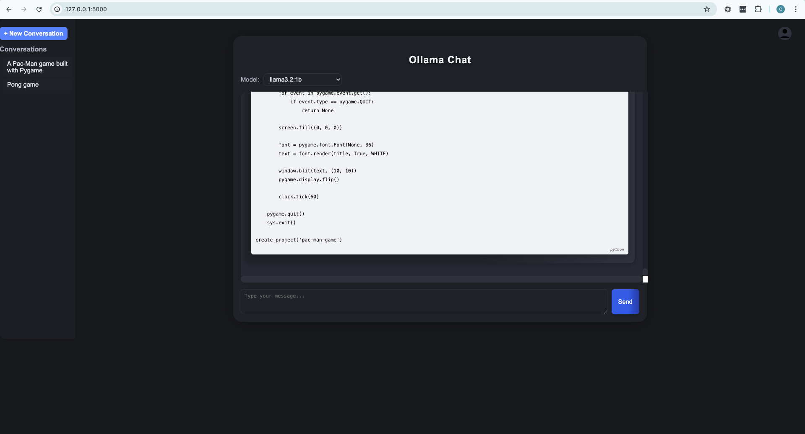

# ollama-model-gui

A webpage which allows the communication of a webpage to ollama. This project was created during a week's work experience placement, exploring the feasibility of migrating Elucidat's AI needs to a locally hosted LLM.

I have experimented with hosting LLM's locally using Ollama and have built a bridge between the backend (where the LLMs are hosted) and the frontend (the website interface for user interaction).




## Key Features & Benefits

-   **Local LLM Interaction:** Facilitates communication with locally hosted Ollama models.
-   **Web Interface:** Provides a user-friendly web interface for interacting with the LLM.
-   **Project Management:**  Features for creating, storing, and managing projects with associated files and ideas.
-   **Chat History:** Stores and retrieves chat history for each project.
-   **Code Execution:** Enables running commands and scripts directly from the interface.
-   **File Management:** Capabilities for creating, deleting, and organizing files and folders within project contexts.

## Prerequisites & Dependencies

Before you begin, ensure you have met the following requirements:

-   **Ollama:**  Ollama needs to be installed and running on your system.  Refer to the official Ollama documentation for installation instructions.
-   **Python 3.6+:**  Python needs to be installed on your system.
-   **pip:** Python package installer.
-   **Flask:**  Python web framework.

## Installation & Setup Instructions

1.  **Clone the repository:**

    ```bash
    git clone https://github.com/cassidymabeyWEX/ollama-model-gui.git
    cd ollama-model-gui
    ```

2.  **Create a virtual environment (recommended):**

    ```bash
    python3 -m venv venv
    source venv/bin/activate   # On Linux/macOS
    venv\Scripts\activate.bat  # On Windows
    ```

3.  **Install the dependencies:**

    ```bash
    pip install -r requirements.txt
    ```

    The `requirements.txt` file contains the following:

    ```
    Flask
    flask_cors
    ollama
    pymongo
    ```

4.  **Set up Environment Variables**
    No environment variables required as of current version.

5.  **Run the application:**

    ```bash
    python main.py
    ```

    The application will start, and you can access it through your web browser at the address provided in the console (typically `http://127.0.0.1:5000`).

## Usage Examples

1.  **Accessing the Web Interface:**

    Open your web browser and navigate to the address provided when running `main.py` (e.g., `http://127.0.0.1:5000`).

2.  **Interacting with Ollama:**

    -   The interface should provide a chat box for sending prompts to the Ollama model.
    -   Type your prompt and send it to receive a response from the model.

3.  **Project Management**
    - You can create new projects by clicking the "New Project" button.
    - Projects are saved in the `projects/` directory.
    - Each project has its own unique ID.
    - Inside each project directory you will find project related files (project_idea.txt, project_success_criteria.txt, etc).

## Configuration Options

There are no real configuration options for the entire project, instead there are optional ones such as the mongo DB api url where you can link a database to store user information. Besides this, everything else works without a config as prompts and other optimisations are already written. 

## Contributing Guidelines

Contributions are welcome!  If you would like to contribute to this project, please follow these guidelines:

1.  **Fork the repository.**
2.  **Create a new branch for your feature or bug fix.**
3.  **Make your changes and commit them with descriptive commit messages.**
4.  **Submit a pull request.**

## License Information

This project is licensed under the MIT License - see the [LICENSE](LICENSE) file for details.

## Acknowledgments

-   This project was built using Flask and Ollama.
-   Assets from various free sources were used for the user interface.

## Note
This was created on another account for my work experience. This is programmed by me
